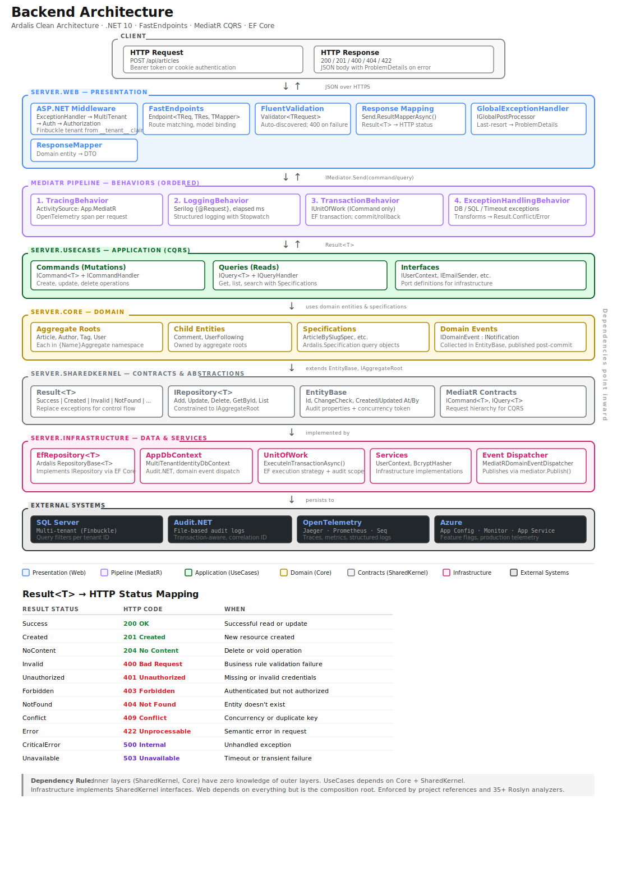

# 🤖 Conduit — RealWorld Vibe-Coded

> **This is an implementation of [gothinkster/realworld](https://github.com/gothinkster/realworld)** — the "Mother of all demo apps" — built on top of the [Agent-First Multi-Tenant Starter Template](https://github.com/james-s-tayler/realworld-vibe-coded/tree/multi-tenant-starter-template). The entire application was developed through agent-first vibe-coding: AI coding agents wrote the code, the build system, the tests, and the CI/CD pipeline, guided by human intent rather than manual implementation.
>
> **RealWorld** is a standardized spec for a Medium.com clone ("Conduit") that lets you compare different frontend/backend implementations. This version pairs a .NET 10 + FastEndpoints backend with a React + TypeScript frontend, demonstrating how a production-grade agent-first workflow can deliver a full-stack application with Clean Architecture, CQRS, multi-tenancy, 32 custom Roslyn analyzers, and a 4-layer test suite.
>
> - [RealWorld Spec](https://github.com/gothinkster/realworld)
> - [API Endpoints](https://docs.realworld.show/specifications/backend/endpoints/)

## What This Project Demonstrates

This is the third RealWorld implementation I've done, and it was for the purpose of learning an agent-first engineering workflow. Every layer of the stack is designed so AI coding agents can build, test, lint, and deploy through a single entry point (`nuke`), with compile-time guardrails that keep generated code correct by default. Most of it was developed through Github Copilot initially, some of it was hand engineered to get the architecture crafted in a way that works well for an agentic workflow, and recently Claude Code has taken over :)

## Tech Stack

| Layer | Technologies |
|:------|:-------------|
| **Backend** | .NET 10, FastEndpoints, MediatR (CQRS), FluentValidation, EF Core + SQLite, Serilog, Audit.NET, Microsoft.FeatureManagement |
| **Frontend** | React 19, Vite, TypeScript, Carbon Design System |
| **Testing** | xUnit, Vitest, Playwright, Postman/Newman |
| **Build** | Nuke Build, GitHub Actions |
| **Infrastructure** | Docker, Bicep (Azure), Azure App Service |

## Architecture

The backend follows [Ardalis Clean Architecture](https://github.com/ardalis/CleanArchitecture) with CQRS via MediatR:

```
Server.Core              — Domain models, aggregates, value objects
Server.SharedKernel      — Common types and shared abstractions
Server.UseCases          — MediatR command/query handlers (business logic)
Server.Infrastructure    — EF Core DbContext, repositories, persistence gateways
Server.Web               — FastEndpoints endpoints, DTOs, mappers, middleware
Server.Web.DevOnly       — Development-only endpoints (seeding, diagnostics)
Server.Analyzers         — 32 custom Roslyn analyzers (SRV + PV series)
```

Endpoints are thin: bind request -> authorize -> delegate to MediatR -> map response. Business rules live in handlers. Persistence is abstracted behind repository interfaces.



**Cross-cutting concerns:**
- **Serilog** — structured logging with enrichers, file sinks, and Seq integration
- **Audit.NET** — automatic audit trails for EF Core entity changes and Identity operations
- **Microsoft.FeatureManagement** — feature flags for toggling functionality at runtime

## Project Structure

```
App/
  Client/                — React + Vite + TypeScript frontend
  Server/                — .NET backend (Clean Architecture)
    analyzers/           — Custom Roslyn analyzers
    src/                 — Application source (Core, UseCases, Infrastructure, Web)
    tests/               — xUnit test projects
Task/
  Runner/                — Nuke build system
  LocalDev/              — Docker Compose for local development
Test/
  e2e/                   — Playwright E2E tests
  Postman/               — Postman/Newman API tests
  Migrations/            — Migration verification tests
Infra/                   — Bicep Azure IaC
Logs/                    — Serilog + Audit.NET logs (per run mode)
Reports/                 — Test reports generated by Nuke targets
Docs/                    — Project documentation
```

## Getting Started

### Prerequisites

- [.NET 10 SDK](https://dotnet.microsoft.com/download)
- [Nuke global tool](https://nuke.build/) — `dotnet tool install Nuke.GlobalTool --global`
- [Node.js 20+](https://nodejs.org/)
- [Docker](https://www.docker.com/)

Once Nuke is installed, run `nuke --help` to display all available targets.

### Build & Run

```bash
# Build, start dependencies, and run the app locally (handles everything via DependsOn)
nuke RunLocalPublish
```

### Run Tests

```bash
nuke TestServer              # Backend xUnit tests
nuke TestClient              # Frontend Vitest tests
nuke TestE2e                 # Playwright E2E tests
nuke TestServerPostmanAuth    # Postman Auth API tests
nuke TestServerPostmanProfiles # Postman Profiles API tests
```

### Lint

```bash
nuke LintAllVerify           # Check all linting (CI mode)
nuke LintAllFix              # Auto-fix lint issues
```

## Nuke Build System

All operations go through `nuke <Target>`. No need to run `dotnet`, `npm`, or `docker` commands directly. Run `nuke --help` to see all available targets.

| Category | Targets |
|:---------|:--------|
| **Build** | `BuildServer`, `BuildClient`, `BuildServerPublish`, `BuildGenerateApiClient` |
| **Test** | `TestServer`, `TestClient`, `TestE2e`, `TestServerPostmanAuth`, `TestServerPostmanProfiles` |
| **Lint** | `LintAllVerify`, `LintAllFix`, `LintServerVerify`, `LintClientVerify`, `LintApiClientVerify` |
| **Database** | `DbMigrationsAdd`, `DbMigrationsVerifyApply`, `DbMigrationsGenerateIdempotentScript`, `DbReset` |
| **Run** | `RunLocalPublish`, `RunLocalDependencies`, `RunLocalClient` |
| **Install** | `InstallClient`, `InstallGitHooks`, `InstallDockerNetwork` |

When a target fails, read the error messages carefully — they include specific guidance on where to find logs and reports.

## Agent-First Workflow

This project is designed to be operated by AI coding agents. Every layer of the development workflow is exposed in a way that agents can discover and invoke.

### CLAUDE.md — Project Instructions

The `CLAUDE.md` file at the repository root provides agents with full project context: tech stack, folder structure, build commands, critical rules, and conventions. This is the entry point for any agent working on the codebase.

### Nuke Build Targets

All Nuke build targets are invocable directly via `./build.sh <Target>`. Run `nuke --help` to see all available targets. Agents use the `--agent` flag to suppress verbose Docker output for context efficiency (e.g., `./build.sh TestE2e --agent`).

- `github-push-pr` — push to PR and monitor CI, auto-investigating failures

### `.claude/rules/` — Coding Rules

Domain-specific coding rules for agents organized by area:

- `backend.md` — endpoint patterns, CQRS conventions, persistence rules, error handling
- `frontend.md` — React/TypeScript conventions, Carbon Design System usage
- `e2e.md` — Playwright Page Object Model, ARIA selectors, assertion patterns
- `functional-tests.md` — FastEndpoints test extensions, test data patterns
- `cicd.md` — GitHub Actions conventions, job naming

### Compile-Time Guardrails — Roslyn Analyzers

32 custom Roslyn analyzers enforce architecture, persistence, endpoint conventions, and testing rules at compile time. The backend framework layers on top of FastEndpoints, `Result<T>`, and MediatR pipeline behaviors:

- **`Result<T>`** — all handlers return `Result<T>` with typed status codes instead of throwing exceptions
- **`ICommand<T>` / `IQuery<T>`** — CQRS interfaces enabling type-safe pipeline behaviors
- **MediatR pipeline behaviors** — `ExceptionHandlingBehavior`, `TransactionBehavior`, `LoggingBehavior`
- **`Send.ResultMapperAsync`** — maps `Result<T>` status to HTTP responses automatically

### Observability — Logs & Reports on Disk

- **`Logs/`** — Serilog structured logs and Audit.NET audit logs, organized by run mode
- **`Reports/`** — HTML test reports from xUnit, Vitest, and Playwright runs

### Kiota API Client Generation

When backend endpoints change, run `nuke BuildGenerateApiClient` to regenerate the TypeScript API client. The drift check `nuke LintApiClientVerify` catches when the generated client is out of sync.

## Testing

| Layer | Framework | Location | Purpose |
|:------|:----------|:---------|:--------|
| **Unit/Integration** | xUnit | `App/Server/tests/` | Backend business logic, handlers, persistence |
| **Component** | Vitest + Testing Library | `App/Client/` | Frontend components, hooks, utilities |
| **E2E** | Playwright | `Test/e2e/` | Full user flows through the browser |
| **API** | Postman/Newman | `Test/Postman/` | API contract validation |

All test results are output to `Reports/` with HTML reports generated by Nuke.

## Deployment

```bash
# Build a publishable artifact (backend + frontend bundled)
nuke BuildServerPublish
```

Infrastructure is defined via Bicep in the `Infra/` directory, targeting Azure App Service.

## Starter Templates

This implementation has been generalized into reusable starter templates:

- [**Single-Tenant Starter Template**](https://github.com/james-s-tayler/realworld-vibe-coded/tree/single-tenant-starter-template) — the same architecture without multi-tenancy, using SQLite
- [**Multi-Tenant Starter Template**](https://github.com/james-s-tayler/realworld-vibe-coded/tree/multi-tenant-starter-template) — adds Finbuckle multi-tenancy, SQL Server, tenant-scoped data isolation
